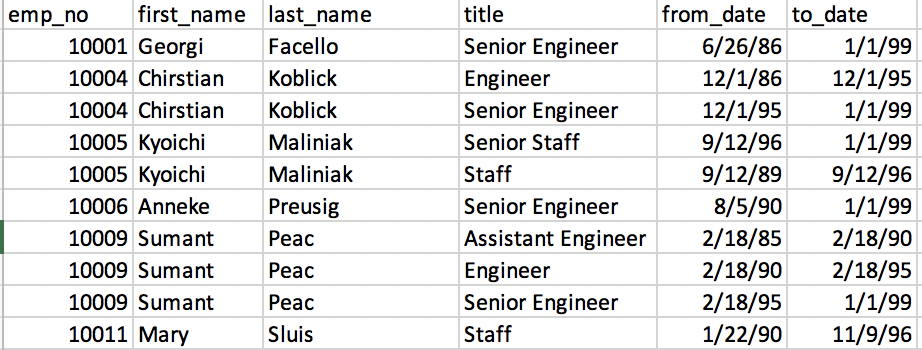
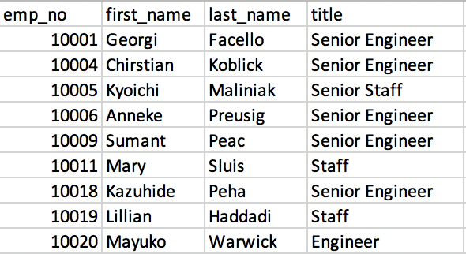
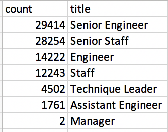
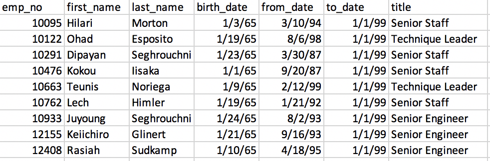
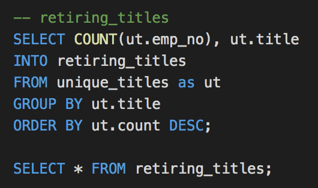
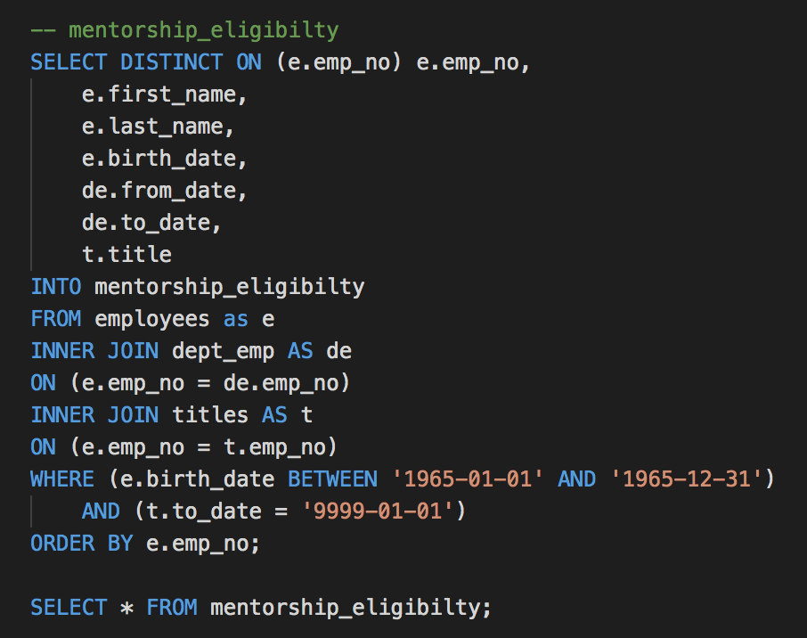

# Pewlett_Hackard_Analysis

## Overview
This project focuses on determining the number of employees that are reaching the stage of retirement. We will be using pgAdmin, SQL to perform the total retiring employees by title. Moreover, this project will identify those who are eligible to participate in a mentorship programs.

## Results
- The retirement titles table presents all the retiring employees whose birthday falls between 1952 and 1955. Table 1 also shows the title, from date and to date of each employee. As shown, there are duplicate entries in the table because we haven’t filtered the table for the most current position.
  
  Table 1: retirement titles

- The unique titles table uses DISTINCT ON statement to retrieve the first occurrence employee number, and it sorts the table in ascending order by the employee number and depending order by the to_date. As table 2 shown, there is no duplicate entry for some employees, and the title has been updated to the most current position.
  
  Table 2: unique titles

- The retiring titles table shows the total retirement employees by their title. Senior Engineer has the most retiring employees, and only 2 manager are retiring.
  
  Table 3: retiring titles

- The mentorship eligibility table determines the employees who were born between 01/01/1965 and 12/31/1965, who are eligible to participate in a mentorship programs.
  
  Table 4: mentorship eligibility

## Summary
The top concerns the company should focus on is the number of retiring employees for some position being too high. Please see query 1 for the retiring employees with titles:
  
 Query 1: retiring employes with titles
First of all, we retrieve the number of titles from the unique titles (table 2) to avoid duplicate entries.  As shown in Table 3, we add all the retiring employees together and get a total of 90,398 employees that reach the stage of retirement. The most impact would be the senior engineer position, it contains the most retiring employees that is about 33% of the total retiring employees. Senior staff has 31% retiring employees, which is the second highest. The company should consider promote engineers and staff to the senior level, or hire senior engineers and staff in order to prevent the “silver tsunami” impacting the company too much. 
  Yes, there are enough qualified, retirement-ready employees in the departments to mentor the next generation of Pewlett Hackard employees. Please see Query 2 for the mentorship eligible employees:
  
  Query 2: mentorship eligibilty
Query 2 shows step by step how we reach the final result of mentorship eligibility employees. Table 4 shows the retiring employees who are currently in position and were born in 1965. There are a total of 1,549 retiring employees so that, all the retiring employees from the table are sorted out in order to meet the requirement.

